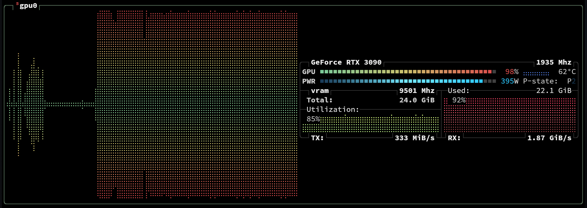

[📰 𝕏]() | [🔥 **Abridged**]() | [😼 **GitHub**](https://github.com/1iis/26D19-1.foundations) | [📚 **SolveIT**]() | [Ⓜ️ **Markdown**](https://github.com/1iis/26D19-1.foundations/blob/main/article.md) | [🗒️ **Raw**](https://github.com/1iis/26D19-1.foundations/raw/refs/heads/main/article.md) |
| --- | --- | --- | --- | --- | --- |

# Dockerizing SGLang + vLLM on local RTX 3090

> **Mission 1: Foundations**  
> *Let's discover the basics of running fast local inference jobs!*
